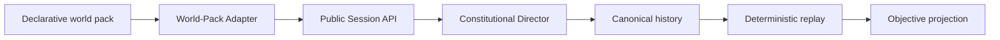

# Custodian

Custodian is a deterministic constitutional simulation framework for building
replayable worlds with external declarative world packs.

It solves the continuity problem in persistent simulations: durable objective
history, causal ordering, observer-local information, and physical outcomes are
kept separate so that a session can be inspected, exported, restored, and
replayed without inventing past truth.



## What makes it different

Custodian treats objective reality, perception, knowledge, belief, memory,
planning, and narration as different constitutional layers. Objective reality
advances only through committed canonical events. World packs declare content
and deterministic rules; they never mutate runtime state or execute arbitrary
code. **Mystery is incomplete information, not withheld information.**

## What works today

- Canonical event history, deterministic ordering, replay, checkpoints, and
  objective projections.
- Observer-local perception, knowledge, belief, memory, relationships, planning,
  decisions, action proposals, execution, and effects.
- Physical topology, objects, resources, environmental conditions, hazards,
  evidence, communication, and the Constitutional Director.
- Public session creation, advancement, inspection, export, and restoration.
- External declarative world-pack validation and deterministic conformance.

Custodian is a framework, not a complete game engine. It deliberately does not
include narration, an LLM, a graphical interface, multiplayer networking,
remote pack discovery, or executable pack plugins.

## Install and run

Custodian requires Node.js 20 or newer.

```sh
git clone https://github.com/flashpwns/custodian.git
cd custodian
npm ci
npm test
npm run validate
npm run demo
npm run replay
```

Run the learning example or the technical external fixture:

```sh
npm run conformance -- examples/signal-room --json
npm run conformance -- external-fixtures/signal-room --json
```

## Create a world pack

Use the official starter locally:

```sh
npm run create-worldpack -- my-world
cd my-world
npm install
npm run conformance
```

After Custodian is published, the same tool is available through its package
binary:

```sh
npx --package=custodian create-custodian-worldpack my-world
```

The generated pack is valid unchanged. Edit its `manifest.json` and
`scenario.json`, then rerun conformance. See the [five-minute tutorial](docs/guides/five-minute-world-pack.md)
and the [full authoring guide](docs/guides/world-pack-authoring.md).

## Minimal public API

Only import the package root; reducers, Director internals, and replay mutation
helpers are not public API.

```js
const {
  createSession,
  advanceSession,
  exportSession,
  restoreSession
} = require("custodian");

const created = createSession({ world_pack, scenario });
if (!created.ok) throw created.error;

const advanced = advanceSession({
  session: created.session,
  tick: { id: "tick-1", at: 1, observers: scenario.observers }
});
if (!advanced.ok) throw advanced.error;

const exported = exportSession(advanced.session);
const restored = restoreSession(exported.envelope);
```

The public package surface and conformance requirements are documented in the
[World-Pack Conformance guide](docs/architecture/world-pack-conformance.md).
Compatible packs declare `canonical-kernel@v1`; this is independent from the
package version and is checked deterministically.

## Constitutional boundaries

```text
objective reality → physical signals → perception → knowledge → belief
→ planning → decision → action proposal → execution → committed event
```

Plans, messages, beliefs, memories, relationships, and future narration cannot
directly mutate objective reality. Narration projects simulation state; it never
creates truth. Read the [constitution](constitution/PRINCIPLES.md) and the
[architecture index](docs/README.md) before extending the framework.

## Project identity and status

Custodian began as a Kane Pixels Backrooms roleplay project and evolved into a
setting-independent framework. Its Backrooms implementation is an external
reference world pack, not the identity of the kernel; Custodian contains no
required fictional canon and has no affiliation with Kane Parsons or other
rights holders. The historic repository name remains for continuity. A future
repository rename to `custodian` is recommended but intentionally not performed
automatically.

Version `1.0.0` is prepared on the release branch; its tag and GitHub Release
are created only after the release PR is merged and main is revalidated.

## Participate

- [Contributing](CONTRIBUTING.md)
- [Security reporting](SECURITY.md)
- [Support policy](SUPPORT.md)
- [Community world-pack showcase](WORLD_PACKS.md)
- [Release notes](docs/releases/v1.0.0.md)

Custodian is MIT licensed; see [LICENSE](LICENSE). Please use the public
contracts and keep third-party content independently licensed.
