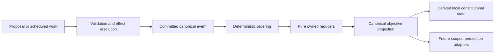

# Kernel convergence and projection foundation

**Normative.** Custodian has one canonical event lifecycle: proposal or scheduled
work, validation, commitment, deterministic ordering, reduction, objective
projection, and replay. Objective state advances only through committed events.
Plans, messages, beliefs, memories, relationships, and future narration cannot
directly mutate it.

> Mystery is incomplete information, not withheld information.

Narration projects simulation state. Narration never creates truth. Perception,
attention, scene projection, disclosure policy, and prose remain outside this
milestone.

## Kernel purity

Every reducer is a pure deterministic transformation of declared input state and
a committed event. Reducers must not depend on wall-clock time, uncontrolled
randomness, filesystem or network state, environment variables, mutable globals,
process-local insertion order, or external I/O. Required nondeterministic input
must first become committed simulation data.

The canonical ordering policy is `time-phase-priority-sequence-id@v1`. Reducers
declare their domain plus accepted event families and read/write ownership. A
reducer cannot write another domain's state; cross-domain work is represented by
subsequent committed events.

## Projection

The canonical objective projection is pinned to session, world-pack version,
schema, reducer set, ordering policy, committed sequence, and simulation time.
Its identity is a SHA-256 digest of canonical serialization of that pinned state.
It contains objective topology, environment, resources, evidence, messages,
actions, and time. It excludes perception, knowledge, belief, memory, trust,
relationships, private plans, disclosure, and prose.

Snapshots are caches. Rebuild from zero and rebuild from a compatible checkpoint
plus later events must produce equivalent projections. A snapshot is invalid when
its world pack, schema, reducer set, migration version, or ordering policy is
incompatible.
